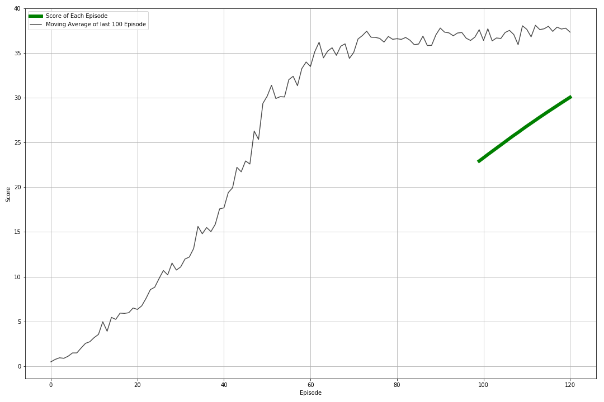

# Report

My Agent succeded in 120 episodes. You can see the plot below of the training



scipt to plot the performance:
``` bash
python view.py
```

In this project, I used **PPO (Proximal Policy Optimization)**
algorithm, and for PPO, I developed **GAE (Generalized Advantage Estimation)**.

For policy, I picked **Actor/Critic framework**, where actor outputs the
probability of actions or draw actions from the disribution based on the current state,
and critic outputs the state value function. To reduce complexity,
actor and critic share hidden layers.

After fixed steps update of multi agent environment, actor and critic are
mini-batch updated by PPO/GAE.

Layers for actor
```
Input: State(33)
Dense(512) LeakyReLU  
Dense(256) LeakyReLU
Dense(4) tanh
Output:
```

Layers for critic
```
Input: State(33)
Dense(512) LeakyReLU   
Dense(256) LeakyReLU  
Dense(1)  
Output:  
```

In the simulator, the agent takes an action from the distribution randomly.
After the actions the agent updates the model and it returns likelihood of
actions of distribution.
The average of the normal distribution uses the output of the actor model. Also
variance parameters of normal distribution is one of the model parameters. output
of the agents changes depending on the normal distribution, the agent can find
an optimal place in between exploration and exploitation.

PPO is a policy based model that has a balance between ease of implementation, sample complexity and ease of tuning.
https://openai.com/blog/openai-baselines-ppo/. It tries to compute and update for each step that minimizes the cost function
while making sure that deviation from the previous policy is small. Which is good balance of exploration and exploitation.

GAE is the method for measuring "generalized advantage", which balance
between TD-error and discounted sum of rewards.
In this project, advantage is calculated based on GAE.

Hyper-parameters

- Discount factor gamma: 0.99
- GAE lambda: 0.96.
- Before model update, advantage is normalized to standard normal distribution.
- PPO clipping parameter (eps): 0.1
- Batch 128
- Actor/Critic are simultaneously updated using sum of loss of each model.
- Model is updated by mini-batch.
  - Optimizer: Adam
  - Learning rate: 1e-4
  - epoch: 10
  - mini batch size: 128


## Future Improvements

- Trials with several other algorithms. I implemented my model with PPO/GAE agent. I want to try DDPG algorithm. Also I want to try Trust Region Policy Optimization, Proximal Policy Optimization (PPO), or Distributed Distributional Deterministic Policy Gradients (D4PG). The results of these 4 algortihms can be compared.

- I want to try adding Q-Prop which I guess will improve my algortihm and check on the improvement.

- I want to try adding prioritized experience replay which selects experiences with respect to the error rate. This might lead to an improvement in convergence of the training.
